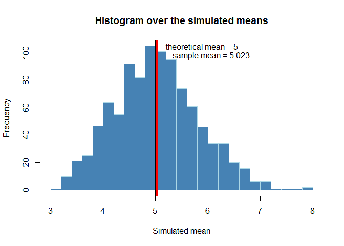
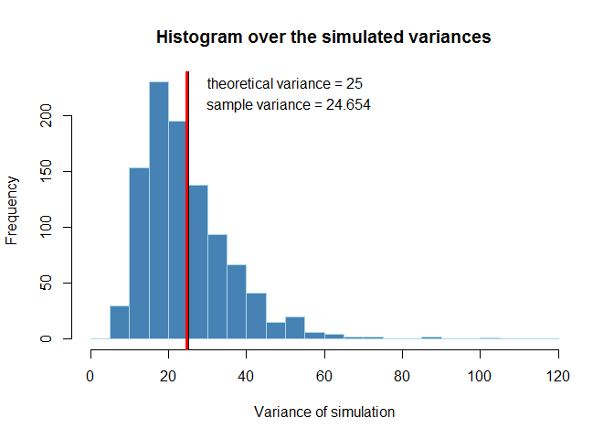
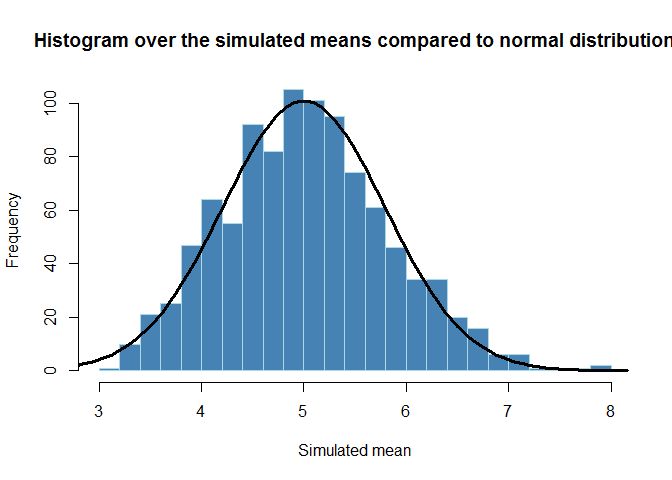

# Statistical inference - Course project
Kristina Juhlin  
#  Simulation study  
In this project you will investigate the exponential distribution in R and compare it with the Central Limit Theorem. The exponential distribution can be simulated in R with rexp(n, lambda) where lambda is the rate parameter. The mean of exponential distribution is 1/lambda and the standard deviation is also 1/lambda. Set lambda = 0.2 for all of the simulations. You will investigate the distribution of averages of 40 exponentials. Note that you will need to do a thousand simulations.

Illustrate via simulation and associated explanatory text the properties of the distribution of the mean of 40 exponentials.  You should
1. Show the sample mean and compare it to the theoretical mean of the distribution.
2. Show how variable the sample is (via variance) and compare it to the theoretical variance of the distribution.
3. Show that the distribution is approximately normal.

In point 3, focus on the difference between the distribution of a large collection of random exponentials and the distribution of a large collection of averages of 40 exponentials. 

## Overview

```r
library(knitr)
```

## Simulations 
I simulate 1000 instances of an experiment where 40 values are drawn from an exponential distribution. In detail, I do this by creating a 1000x1 vector of lambda and then simluating 40 values for each element in the vector using the r function rexp. I then compute the mean for each of the 1000 simulations and store in the variable *mu_dist*. 


```r
# Initiate lambda to 0.2
lambda   <- 0.2
nsim <- 1000
n <- 40;

# simulate 40 observations 1000 times
set.seed(314)
simulations <- sapply(rep(lambda,nsim), FUN = function(x) (rexp(n, x)))

# compute the mean for each of the 1000 simulations
mu_simulations <- apply(simulations, MARGIN=2, mean)
```
## Sample Mean versus Theoretical Mean
To see how the simulated means are distributed i plot them in a histogram. The theorethical mean of the exponential distribution is 1/lambda, which in this case gives us a theoretical mean of 5. I have added a black line at the theoretical mean to show how the distribution of the simulated means is placed in relation to the theoretical mean. I have also added a red line to show the sample mean (the mean of all the simulated means).


```r
# compute the sample mean and the theoretical mean
mu_sample <- mean(mu_simulations)
mu_theor <- 1/lambda 

# plot to see how the means are distributed 
hist(mu_simulations, col="steelblue", border = "light blue", breaks=20, main="Histogram over the simulated means", xlab="Simulated mean")
abline(v=mu_theor, lwd=3)
abline(v=mu_sample, lwd=3, col="red")
text(x=5.89, y=105, paste("theoretical mean =", mu_theor))
text(x=6.07, y=98, paste("sample mean =", round(mu_sample,3)))
```

 

## Sample Variance versus Theoretical Variance 
The theoretical variance is defined as $V=\frac{1}{\lambda^{2}}$, and the sample variance for each simulation can be computed as $s_{n}^{2}=\frac{1}{N}\sum{(x_{i}-m)^{2}}$ where $m$ is the sample mean. I compute the sample variance for each of the 1000 simulations and plot in a histogram, together with the theoretical variance (black line) and mean sample variance (red line). We see that the distribution of the variance is not centered around the teorethical value and does not seem to be symmetric. However, the mean sample variance is still very close to the theorethical value.


```r
sd_theor <- 1/lambda
var_theor<- sd_theor^2

# compute the sample variance for each of the 1000 simulations
var_simulations<-rep(0,1000)
for (i in 1:1000){
var_simulations[i] <- (1/n)*sum((simulations[,i]-mu_simulations[i])^2)
}

# mean of variances
var_sample <- mean(var_simulations) 

hist(var_simulations, col="steelblue", border = "light blue", breaks=seq(from=0, to= 120, by=5),
     main="Histogram over the simulated variances", xlab="Variance of simulation")
abline(v=var_theor, lwd=3)
abline(v=var_sample, lwd=3, col="red")
text(x=50, y=230, paste("theoretical variance =", var_theor))
text(x=51, y=210, paste("sample variance =", round(var_sample,3)))
```

 

## Distribution 
Via figures and text, explain how one can tell the distribution is approximately normal.

```r
mean=1/lambda; sd=1/lambda
sd_mean<- sd/sqrt(40)
x <- seq(-4,4,length=100)*sd_mean + mean
hx <- dnorm(x,mean,sd_mean)

hist(mu_simulations, col="steelblue", border = "light blue", breaks=20, main="Histogram over the simulated means compared to normal distribution", xlab="Simulated mean")

points(x, 200*hx, type="l", lwd=3, 
       xlab="normal distribution", ylab="",
        main="Normal Distribution")
```

 

# Inference analysis of tooth growth

## Summary of data 
Load the ToothGrowth data and perform some basic exploratory data analyses 

## Comparison of toot growth 
Use confidence intervals and/or hypothesis tests to compare tooth growth by supp and dose. (Only use the techniques from class, even if there's other approaches worth considering)

## Assumptions and conclusions 


